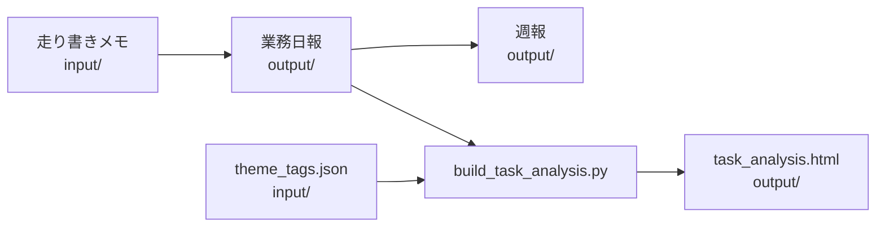
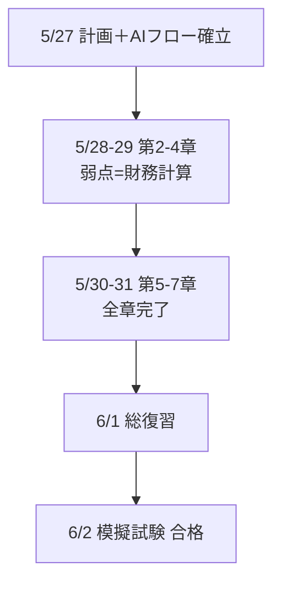

# 日報・週報・タスク分析
## プロジェクト全体の説明資料

**対象期間の事例**: ビジマネ検定 学習（2026/05/27〜06/02）

---

## このプロジェクトでやったこと

1. **業務日報**のテンプレート整備と、実データ＋架空の過去分の作成
2. **週報**への集約（7日分の日報を1本に）
3. **タスク分析ページ**の自動生成（テーマ別集計・グラフ）

→ 「メモ → 日報 → 週報 → 可視化」までを一連のワークフローとして検証

---

## プロジェクトの作業ルール

| ルール | 内容 |
|--------|------|
| ① 削除禁止 | 既存ファイルは削除しない |
| ② 入出力分離 | `input/` = 元データ・設定、`output/` = 生成物 |
| ③ 不明点は確認 | 仕様が曖昧なときは推測で進めない |

日報の**原本**は `input/`、整形・集計結果はすべて `output/` に出力

---

## フォルダ構成

```
cursor_test/
├── input/
│   ├── 日報テンプレート.md    … 日報のひな形
│   ├── 20260602.md            … 走り書きメモ（実入力）
│   └── theme_tags.json        … 分析用テーマ定義
├── output/
│   ├── YYYYMMDD_日報.md       … 日報（7件）
│   ├── 20260602_週報.md       … 週報
│   ├── task_analysis.html     … 分析ページ
│   └── （本資料）
├── scripts/
│   └── build_task_analysis.py … HTML生成スクリプト
└── .cursor/rules/             … 共通ルール
```

---

## ワークフロー全体像



**ポイント**: インプットを上書きせず、加工結果だけを `output/` に蓄積

---

## Step 1 — 日報テンプレート

`input/日報テンプレート.md` をベースに統一フォーマット

- 基本情報（日付・氏名）
- 本日の目標（チェックボックス）
- 業務内容（時間帯 × 表）
- 成果・所感（事実／所感／改善を分離）
- 明日の予定（優先度付き）

**所感は PREP**（結論→理由→具体例→結論）で書くと伝わりやすい

---

## Step 2 — 実日報の作成（6/2）

**入力**: `input/20260602.md`（短い走り書き）

> 模擬試験で合格。AIごり押し学習。しらみつぶしが残り…

**出力**: `output/20260602_日報.md`

- 模擬試験 **合格**（合格ライン付近）
- AI学習（読み込み・通勤中音声・NotebookLM）
- 本番前の残課題を「しらみつぶし」として明文化

---

## Step 3 — 過去1週間の日報（架空データ）

`20260602_日報.md` を起点に、**5/27〜6/1** の6日分を一貫ストーリーで作成

| 日付 | ハイライト |
|------|------------|
| 5/27 | 学習計画・AIフロー初回・第1章完了 |
| 5/28 | 第2章・NotebookLM導入 |
| 5/29 | 第3〜4章・計算弱点発見 |
| 5/30 | 第5章・計算演習強化 |
| 5/31 | 全7章インプット完了 |
| 6/1 | 総復習・弱点リスト15項目 |
| 6/2 | 模擬試験合格（実データ） |

---

## 学習ストーリー（1週間）



**数値の変化**: 章 0/7 → **7/7** ／ 計算正答率 60% → 80% ／ BSC演習 90%

---

## AI活用型の学習サイクル

| 用途 | 手段 | 向いていた章 |
|------|------|----------------|
| インプット | テキストをAI読み込み → 要点抽出 → **音声化** → 通勤中聴取 | 経営戦略・マーケ等（概念系） |
| 暗記整理 | **NotebookLM** で条文・用語を一覧化 | 経営法務・経営環境 |
| 弱点克服 | 原文照合＋**演習反復** | 財務・会計（計算系） |

従来の「ページを順に読む」方式より短納期で全章を回せた

---

## Step 4 — 週報の作成

7件の日報を集約 → `output/20260602_週報.md`

**主なセクション**

- 今週の目標（期初）／週間サマリー（日別表）
- 成果・数値まとめ／所感・振り返り
- 来週の予定（しらみつぶし・AI学習継続・本番準備）

**週の結論**: 全章完了＋模擬試験合格。ただし得点に余裕はなく、再現性のある手応えが課題

---

## Step 5 — タスク分析ページ

**要件**: 日報データから **テーマ別** にタスクを集計し、ブラウザで閲覧

| ファイル | 役割 |
|----------|------|
| `input/theme_tags.json` | キーワードでテーマ分類（4テーマ＋その他） |
| `scripts/build_task_analysis.py` | 日報MDをパース → JSON集計 → HTML生成 |
| `output/task_analysis.html` | グラフ・フィルタ付き静的ページ |

---

## テーマ定義（theme_tags.json）

| テーマ | 例キーワード |
|--------|----------------|
| ビジマネ検定 | 模擬試験、第○章、BSC、合格 |
| AI学習 | NotebookLM、音声化、通勤、学習フロー |
| 財務・計算演習 | 比率分析、損益分岐、確認問題 |
| 復習・計画 | 総復習、学習計画、弱点リスト |

キーワードは `input/theme_tags.json` を編集するだけで変更可能

---

## 分析ページの中身

**集計結果（5/27〜6/2）**

- 日報: **7件** / 抽出テキスト: **92件**
- 言及数（複数テーマ該当あり）: ビジマネ 68 / AI学習 54 / 財務演習 29 / 復習・計画 13

**UI機能**

- テーマ別棒グラフ・日別積み上げグラフ（Chart.js）
- 詳細表（テーマ・セクション・キーワードでフィルタ）

---

## パーサが読む日報セクション

`build_task_analysis.py` が抽出する箇所:

1. **本日の目標** — チェックボックス（完了/未完了）
2. **業務内容** — 表のデータ行
3. **本日の成果・実績** — 箇条書き
4. **明日の予定** — 優先度付き表

日付は基本情報の表を優先（ファイル名と不一致時は警告）

---

## 再生成の手順

日報を追加・更新したあと:

```powershell
cd c:\Users\swao2\Desktop\cursor_test
python scripts\build_task_analysis.py
```

→ `output\task_analysis.html` をブラウザで開く（`file://` で動作）

---

## Marp 資料のプレビュー方法

**VS Code / Cursor**

1. 拡張機能「Marp for VS Code」をインストール
2. 本ファイル `20260603_プロジェクト説明資料.marp.md` を開く
3. プレビューまたは PDF / PPTX エクスポート

**CLI（任意）**

```powershell
npx @marp-team/marp-cli output\20260603_プロジェクト説明資料.marp.md --pdf
```

---

## 成果物一覧

| 種別 | 件数・ファイル |
|------|----------------|
| 日報 | 7件（`20260527` 〜 `20260602`） |
| 週報 | 1件（`20260602_週報.md`） |
| 分析HTML | 1件（`task_analysis.html`） |
| 設定 | `theme_tags.json`、日報テンプレート |
| 本資料 | Marp形式の説明スライド |

---

## 振り返りと今後

**うまくいったこと**

- 入出力分離で原本と生成物が混ざらない
- 日報フォーマットが週報・分析の両方に再利用できる
- テーマタグで「何に時間を使ったか」が可視化できる

**次にできること**

- 週報テンプレートを `input/` に追加
- 日報追加時の分析HTML自動更新（フック等）
- 本番試験後の実績で架空データを差し替え

---

# ご清聴ありがとうございました

**質問・修正**はチャットまたはファイル直接編集で対応可能です
